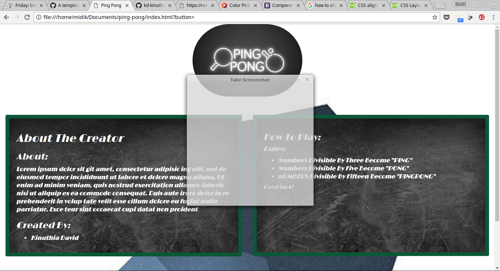
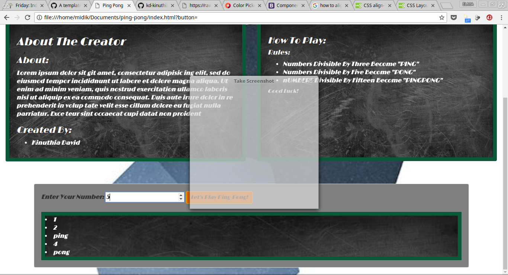

# PING-PONG
#### returns ping pong upon input of a number , 4th May,2018.
#### By **KINUTHIA DAVID**
## DESCRIPTION:
Allows a user to input a number and displays ping for numbers divisible by 3, pong for numbers divisible by 5, and pingpong for numbers divisible by 15.



## SPECIFICATIONS:
### allows a user to input a number
### numbers that are divisible by 3 become ping
```
if ((i%3) === 0) { storedarray.push("ping");
```
### numbers that are divisible by 5 become PONG
```
else if ((i%5) === 0 ){  storedarray.push("pong");
```
### numbers that are divisible by 15 become PINGPONG
```
else if ((i%15) === 0) {storedarray.push("pingpong");
```
### if a number is neither divisible  by 3, 5, or 15, the number is displayed as it is
```
else {storedarray.push(i);
  ```


  ## SETUP/INSTALLATION:
  * Does not require any installation as it is a webpage and not a software-based game.Click on the following link to visit the webpage
  [ping pong](https://kd-kinuthiadavid.github.io/ping-pong/)

  ## KNOWN BUGS:
  No known bugs as od the time of publishing
  ## BUILT WITH:
  * HTML
  * CSS
  * Bootstrap
  * Javascript
  * jQuerry
  ## SUPPORT AND CONTACT DETAILS:
  Email:kd.kinuthiadavid@gmail.com

  ## ACKNOWLEDGEMENTS:

  * hats off for my Technical Mentors(TMs) at Moringa School for their support during my coursework
  * MORINGA SCHOOL for the facilitation of the much needed and appreciated infrastructure/facilities/environment
  * colleagues/classmates
  ## LICENSE:

  This project is licensed under the MIT License - see the [LICENSE.md](LICENSE) file for details

  Copyright (c) 2018 **KINUTHIA DAVID.**
